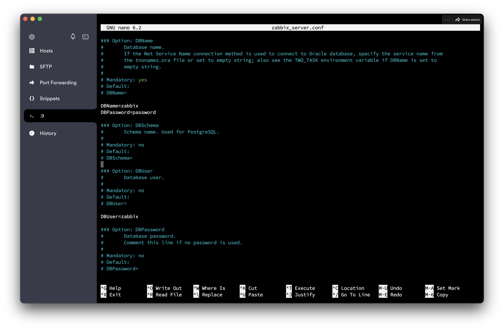

# Deploy Zabbix on your Web Server for Monitoring

## So What is Zabbix?
Zabbix is an open-source monitoring tool for servers, virtual machines, cloud services and more. It monitors the health and integrity of multiple parameters of a network and servers such as network usage, disk space consumption, and CPU load. Zabbix also utilizes a flexible notification mechanism that allows users to configure e-mail based alerts for virtually any event. The tool uses a separate database to store the data and monitor the applications.

## How to Download and Install Zabbix?

I'll outline the steps I followed from the [Official Zabbix Website](https://www.zabbix.com) depending on your server architecture. I am working on an Ubuntu Server 22.04 and using MySQL on Apache driven web server.

First things first, 

### 1. Install and configure Zabbix on your platform:

Start by installing the zabbix repository
```shell
wget https://repo.zabbix.com/zabbix/6.4/ubuntu/pool/main/z/zabbix-release/zabbix-release_6.4-1+ubuntu22.04_all.deb
dpkg -i zabbix-release_6.4-1+ubuntu22.04_all.deb
apt update
```

Next, install zabbix server, frontend and agent
```shell
apt install zabbix-server-mysql zabbix-frontend-php zabbix-apache-conf zabbix-sql-scripts zabbix-agent
```

Now we will create the database that zabbix uses to store data.

Log into mysql and input your password
```shell
mysql -uroot -p
```
Run the following
```mysql
mysql> CREATE DATABASE zabbix CHARACTER SET utf8mb4 collate utf8mb4_bin;
mysql> CREATE USER zabbix@localhost IDENTIFIED BY 'password';
mysql> GRANT ALL PRIVILEGES ON zabbix.* TO zabbix@localhost;
mysql> SET GLOBAL log_bin_trust_function_creators = 1;
mysql> QUIT;
```

On Zabbix server host import initial schema and data. You will be prompted to enter your newly created password.

```shell
zcat /usr/share/zabbix-sql-scripts/mysql/server.sql.gz | mysql --default-character-set=utf8mb4 -uzabbix -p zabbix
```
Disable log_bin_trust_function_creators option after importing database schema.
```mysql
mysql -uroot -p
password
mysql> SET GLOBAL log_bin_trust_function_creators = 0;
mysql> QUIT;
```
Next you want to configure the database for zabbix server. 
Head over to the `/etc/zabbix/zabbix_server.conf` file and nano or vim into it.

Add into the file
```
DBPassword="password"
```
as shown below



Last but not least, start the zabbix server and agent process

```shell
systemctl restart zabbix-server zabbix-agent apache2
systemctl enable zabbix-server zabbix-agent apache2
```

Now you can open the Zabbix UI web page. The default URL for Zabbix UI when using Apache web server is http://host/zabbix i.e http://192.168.1.9/zabbix